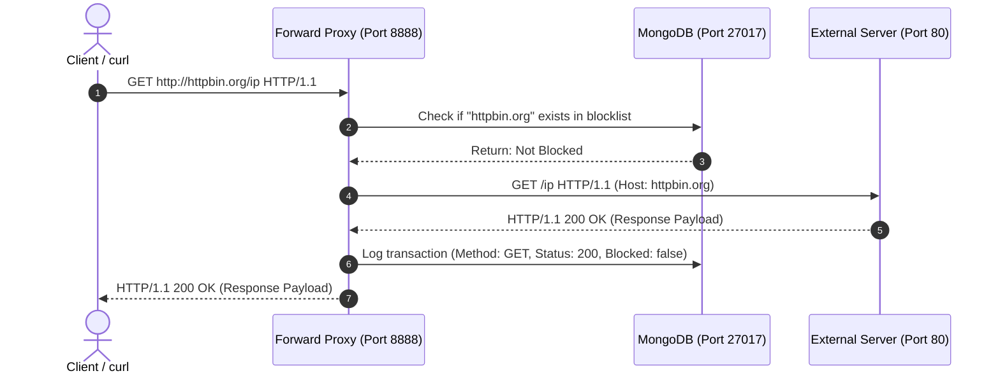
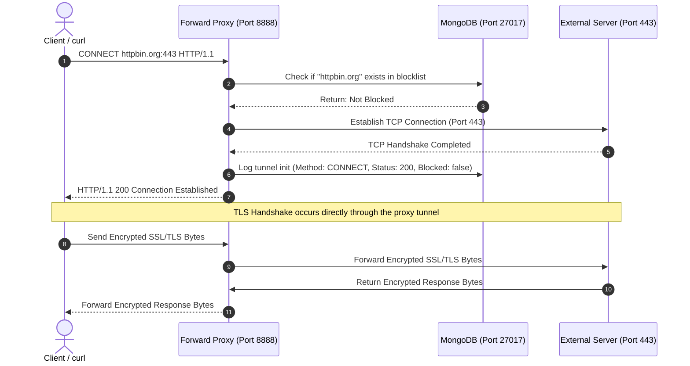
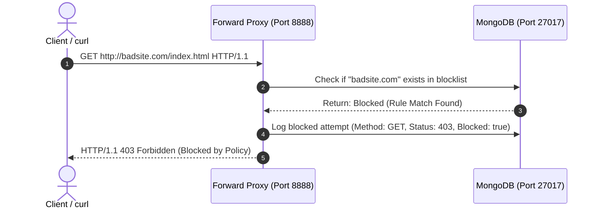

# Forward Proxy Network Architecture and System Overview

This document provides a detailed description of the network topology, component interactions, transport protocols, and data models of the Forward Proxy Lab environment.

---

## System Architecture and Components

The lab operates on a single private Docker bridge network named `proxy-net`. The architecture is comprised of three Docker containers hosting the following systems:

### 1. Administrative Dashboard Frontend (Container: `proxy-ui`)
- **Technology Stack**: React, Vite, and Nginx.
- **Network Interface**: Listens on internal port 80, mapped to host port 8080.
- **Primary Function**: Hosts static single-page application assets and routes requests.
- **Reverse Proxy Routing**: Configured in Nginx (`nginx.conf`) to transparently forward requests arriving at `http://localhost:8080/api/*` to `http://proxy-server:5000/api/*`.

### 2. Forward Proxy and API Server Backend (Container: `proxy-server`)
- **Technology Stack**: Node.js, Express, `http-proxy` library, and `net` module.
- **Network Interface**: Exposes port 5000 (API endpoints) and port 8888 (Forward Proxy).
- **Concurrent Roles**:
  - **API Server (Port 5000)**: Serves internal configuration requests (blocklist updates, stats aggregation, logs display) and routes inline proxy tests.
  - **HTTP Forward Proxy (Port 8888)**: Evaluates requests against blocklist rules in real-time, forwards allowed HTTP traffic, logs transactions, and handles raw TCP tunneling for HTTPS CONNECT requests.

### 3. Database Persistence Layer (Container: `proxy-mongo`)
- **Technology Stack**: MongoDB (version 6).
- **Network Interface**: Exposes internal port 27017, accessible only to containers on the bridge network.
- **Primary Function**: Stores log records of forwarded and blocked traffic and holds active blocklist definitions.

---

## Detailed Network Traffic Flow Sequence Diagrams

The diagrams below outline the sequence of network handshakes and data flow across different request scenarios.

### Scenario A: Unencrypted HTTP GET Request (Allowed)

For plain-text HTTP connections, the proxy receives the target URL, inspects it, and acts as an active relay.

### Scenario B: Encrypted HTTPS CONNECT Tunnel (Allowed)

For secure HTTPS connections, the client uses the CONNECT method to request a raw TCP pipe. The proxy cannot inspect the encrypted payloads passing through this pipe.

### Scenario C: Blocked Request (HTTP or HTTPS CONNECT)

When a domain name matches a rule in the blocklist database, the proxy halts request execution immediately.

---

## Data Architecture and Models

The application uses two MongoDB schemas defined via Mongoose in the backend server:

### 1. `BlocklistRule` Collection
Stores target domains restricted from access.
- `domain` (String, Required, Unique): The domain or subdomain string to match (e.g., `badsite.com`).
- `createdAt` (Date, Default: Now): Timestamp indicating when the restriction was added.

### 2. `ProxyLog` Collection
Stores an audit trail of requests processed by the system.
- `method` (String): The HTTP action or proxy command (e.g., `GET`, `POST`, `CONNECT`, `TEST`).
- `url` (String): The target destination URL or endpoint address.
- `statusCode` (Number): The response status code returned to the client (e.g., 200, 403, 502).
- `clientIp` (String): The originating IP address of the client making the request.
- `blocked` (Boolean): Indicates whether the request was denied by the ACL policy.
- `timestamp` (Date, Default: Now): Event logging timestamp.

---

## Network Security Configurations

- **Bridge Network Isolation**: Containers communicate using private DNS names (`mongodb`, `proxy-server`) within the virtual Docker network.
- **Access Control List (ACL)**: The proxy inspects hostnames using substring-matching logic. If a requested destination contains a blocked domain pattern, the request is intercepted.
- **Masking IP Origins**: The proxy establishes target connections using its own host network interface. External servers register the connection as arriving from the proxy container rather than the internal client.
