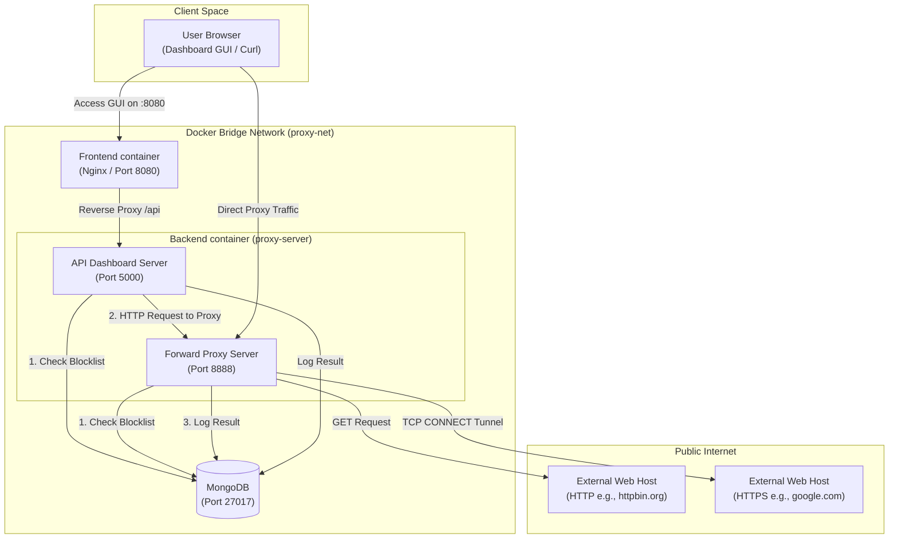

# Forward Proxy Lab Console

A containerized Forward Proxy Server and Dashboard built with Node.js, Express, MongoDB, and React. 

This project demonstrates how a Forward Proxy sits between a client and the external internet to control, monitor, log, and filter outbound network requests based on configured blocklist rules.

---

## Architecture Overview

The system consists of four primary components deployed inside a bridge network via Docker Compose:
1. **Frontend Dashboard (React and Vite)**: Renders the administration dashboard, showing stats, logs, and blocklist rules, plus an inline tool to execute test proxy requests.
2. **Backend Proxy Server (Node.js)**: Runs two concurrent servers in a single process:
   - **Forward Proxy (Port 8888)**: Standard HTTP Forward Proxy that intercepts and routes traffic, including CONNECT tunnel handling for HTTPS. It evaluates target domains against the blocklist and logs every attempt to MongoDB.
   - **API Dashboard Controller (Port 5000)**: Serves internal endpoints for dashboard configuration (stats, logs, rule additions/deletions, and proxy-test execution).
3. **Database (MongoDB)**: Persists blocked/allowed connection log documents and active blocklist domains.
4. **Proxy UI Server (Nginx)**: Runs inside the Frontend container to host Vite build assets and reverse-proxies dashboard /api requests to the Backend.

### Network Traffic Flow



---

## Project Structure

```
2.ForwardProxy-1/
├── backend/
│   ├── .dockerignore
│   ├── .env                    # Local environment config
│   ├── Dockerfile              # Node.js runner setup
│   ├── index.js                # Consolidated Server (API and Forward Proxy)
│   ├── package.json
│   └── package-lock.json
├── frontend/
│   ├── public/                 # Static assets
│   ├── src/
│   │   ├── services/
│   │   │   └── api.js          # API Client calls using Axios
│   │   ├── styles/
│   │   │   └── main.css        # Clean, responsive CSS styling
│   │   ├── App.css
│   │   ├── App.jsx             # Unified management console dashboard
│   │   └── main.jsx
│   ├── Dockerfile              # Nginx assets build and deploy image
│   ├── eslint.config.js
│   ├── index.html
│   ├── nginx.conf              # SPA configuration and API proxying rules
│   ├── package.json
│   └── vite.config.js          # Proxy definitions for dev environment
├── docker-compose.yml          # Container configuration
└── README.md                   # This documentation file
```

---

## Setup and Usage

### Prerequisites
Ensure you have the following installed on your host system:
- Docker Engine (with Docker Compose v2)

### Running the Environment
From the root project directory (2.ForwardProxy-1), run:

```bash
# Build and launch all services in the background
docker-compose up --build -d
```

Confirm that the containers are healthy:
```bash
docker-compose ps
```

The services will be exposed at:
- **Management Console UI**: http://localhost:8080
- **API Dashboard Backend**: http://localhost:5000
- **Forward Proxy Port**: localhost:8888

---

## Testing and Validation

### 1. Verification via the GUI Dashboard
1. Open http://localhost:8080 in your browser.
2. In the Blocklist Rules card, type badsite.com and click Add Block Rule.
3. Under Test URL Through Proxy, input http://badsite.com or https://badsite.com and click Test via Proxy.
   - You will see a red indicator saying Blocked: Domain "badsite.com" is blacklisted.
4. Input a standard site like https://httpbin.org/ip and run the test.
   - You will see a green status code (200) and the external IP response preview.
5. Check the Recent Proxy Logs table at the bottom to see logs generated for these requests.

### 2. Verification via Command Line (Curl)
You can test the forward proxy's behavior directly using curl.

#### HTTP Forwarding:
```bash
curl.exe -x http://localhost:8888 http://httpbin.org/ip
```
Expected Result: Returns JSON showing the request origin IP address. A log entry is added to MongoDB as Allowed.

#### HTTPS CONNECT Tunneling:
```bash
curl.exe -x http://localhost:8888 https://httpbin.org/user-agent
```
Expected Result: Establishes a TLS session over a TCP tunnel. Returns the user agent headers.

#### Testing Blocklist:
Ensure badsite.com is in your blocklist, then execute:
```bash
curl.exe -i -x http://localhost:8888 http://badsite.com
```
Expected Result:
```http
HTTP/1.1 403 Forbidden
Content-Type: text/plain

Access to badsite.com is blocked by proxy policy.
```

---

## Configuration Variables

The following options are configured in the backend/.env file or environment variables in docker-compose.yml:
- PORT: Dashboard API Server port (default 5000).
- PROXY_PORT: Forward Proxy listening port (default 8888).
- MONGODB_URI: MongoDB connection connection string.
- BLOCKLIST_ENABLED: Set to true to activate domain filtering.
