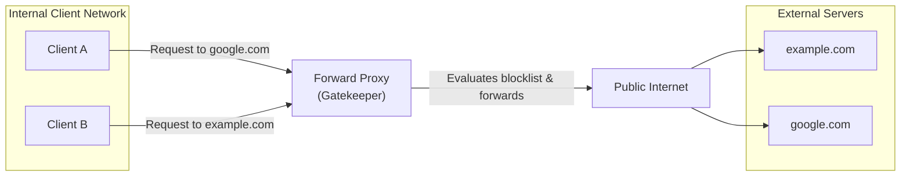
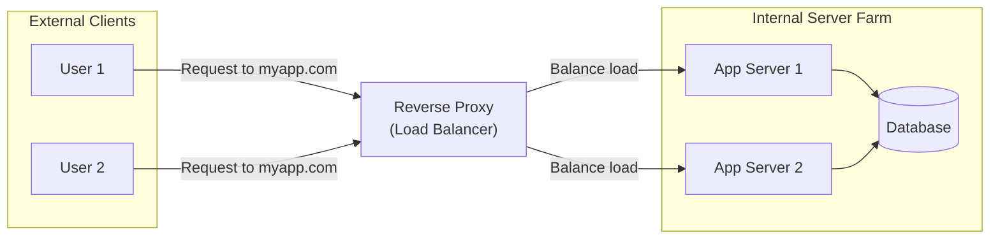

# Educational Tutorial: Understanding Forward Proxies

Welcome to the **Forward Proxy Lab Tutorial**! This guide is designed to help you understand the architectural principles, transport protocol mechanics, and practical operations of a Forward Proxy server.

---

## 🧐 What is a Forward Proxy?

A **Forward Proxy** (or simply "proxy") is an intermediary server that acts on behalf of a group of **clients** (usually inside an internal private network) to forward their outbound requests to the external internet.

When a client makes a request to a resource on the internet:
1. Instead of contacting the destination server directly, the client sends the request to the Forward Proxy.
2. The proxy evaluates the request (applying filters, caching rules, or security checks).
3. If allowed, the proxy forwards the request to the destination server.
4. The destination server sees the request as originating from the *proxy's IP address*, not the client's.
5. The proxy receives the response and sends it back to the client.

---

## 🔄 Forward Proxy vs. Reverse Proxy

The main difference lies in **which party** the proxy server represents.

### 1. Forward Proxy (Acts for Clients)
A Forward Proxy shields and controls **internal clients** accessing the **external web**. The external web servers do not know the identity of the specific client behind the proxy.



### 2. Reverse Proxy (Acts for Servers)
A Reverse Proxy shields and controls **external clients** accessing **internal servers**. External clients think they are talking directly to the website, but the Reverse Proxy intercepts the requests to perform load balancing, SSL termination, or caching.



### Key Differences Summary

| Feature | Forward Proxy | Reverse Proxy |
| :--- | :--- | :--- |
| **Whom it shields** | The Client (browser, user) | The Server (API, database, application) |
| **Visibility to Client** | Client explicitly configures proxy | Client is unaware proxy exists |
| **Primary Use Cases** | Policy enforcement, content filtering, security auditing | Load balancing, SSL offloading, caching, DDoS protection |
| **Outbound/Inbound** | Manages outbound traffic | Manages inbound traffic |

---

## ⚡ Protocol Mechanics: GET vs. CONNECT

A Forward Proxy handles plain HTTP traffic and encrypted HTTPS traffic using two completely different protocol mechanisms.

### 1. The HTTP GET/POST Proxy Request (Transparent Interception)
For unencrypted HTTP requests, the proxy can inspect the full HTTP headers and request body.
- The client establishes a TCP connection to the proxy.
- The client sends a standard HTTP request, but uses an absolute URL in the request line:
  ```http
  GET http://example.com/index.html HTTP/1.1
  Host: example.com
  User-Agent: Mozilla/5.0
  ```
- The proxy parses the headers, evaluates the host (`example.com`) against the blocklist, and calls the destination. It returns the raw payload to the client.

### 2. The HTTPS CONNECT Request (TCP Tunneling)
For encrypted HTTPS traffic, the client wants to establish a secure SSL/TLS session with the destination server. To prevent the proxy from eavesdropping on the encrypted data, the client uses the **HTTP CONNECT** method.
- The client sends an unencrypted CONNECT request to the proxy:
  ```http
  CONNECT example.com:443 HTTP/1.1
  Host: example.com:443
  ```
- The proxy extracts the destination (`example.com`) and evaluates it against the blocklist.
- If allowed, the proxy establishes a direct TCP socket connection to `example.com` on port 443.
- The proxy returns a `200 Connection Established` response to the client.
- The proxy then acts as a **blind tunnel** (a TCP pipe), copying raw bytes back and forth between the client and the destination without decrypting or modification. The TLS handshake occurs directly between the client and the destination.

---

## 🛠️ Practical Demonstrations with Curl

Let's test these concepts using curl commands targeting our proxy server on `localhost:8888`.

### Demo 1: Inspecting an Allowed HTTP Request
Run the following command:
```bash
curl -v -x http://localhost:8888 http://httpbin.org/ip
```
In the verbose logs, you will observe the direct HTTP request header containing the full path sent to the proxy:
```http
> GET http://httpbin.org/ip HTTP/1.1
> Host: httpbin.org
> User-Agent: curl/8.0.1
```
The proxy acts on this request, downloads the response from `httpbin.org`, and passes it back.

### Demo 2: Inspecting an Allowed HTTPS Request
Run the following command:
```bash
curl -v -x http://localhost:8888 https://httpbin.org/ip
```
Notice the initial tunnel creation handshake:
```http
* Connected to localhost (127.0.0.1) port 8888
> CONNECT httpbin.org:443 HTTP/1.1
> Host: httpbin.org:443
> User-Agent: curl/8.0.1
< HTTP/1.1 200 Connection Established
* Proxy replied 200 to CONNECT request
* ALPN, offering h2
* ALPN, offering http/1.1
* TLSv1.3 (OUT), TLS handshake, Client hello (1):
* TLSv1.3 (IN), TLS handshake, Server hello (2):
```
The TLS handshake occurs successfully *through* the established proxy pipe!

### Demo 3: Blocklist Interception
Add `blockeddomain.com` to the dashboard, and execute:
```bash
curl -i -x http://localhost:8888 http://blockeddomain.com
```
The proxy immediately terminates the request and issues:
```http
HTTP/1.1 403 Forbidden
Content-Type: text/plain

Access to blockeddomain.com is blocked by proxy policy.
```

If you send an HTTPS CONNECT request to a blocked site:
```bash
curl -i -x http://localhost:8888 https://blockeddomain.com
```
The connection is rejected immediately:
```http
HTTP/1.1 403 Forbidden
Connection: close
```

---

## 🔒 Security & Compliance Use Cases

Forward Proxies are a cornerstone of modern corporate and enterprise security architectures:
1. **Data Loss Prevention (DLP)**: Inspecting outbound uploads to ensure proprietary source code or customer data isn't leaking to public hosts.
2. **Access Auditing & Logging**: Logging every website visited by internal servers or employees for auditing.
3. **Malware / Phishing Blocking**: Subscribing to threat feeds and blocking connections to known malware hosts, command-and-control (C2) domains, or phishing portals.
4. **Caching & Bandwidth Optimization**: Caching large software updates (like Windows/Linux updates) locally to reduce internet bandwidth usage.
