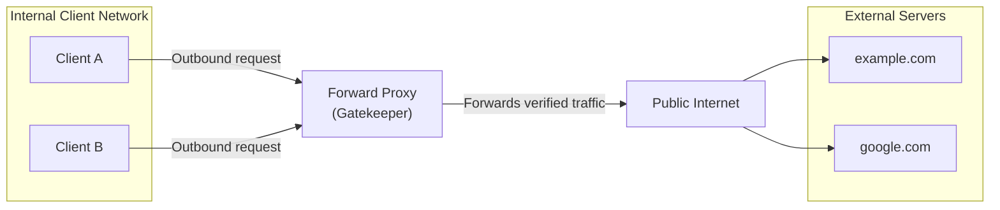
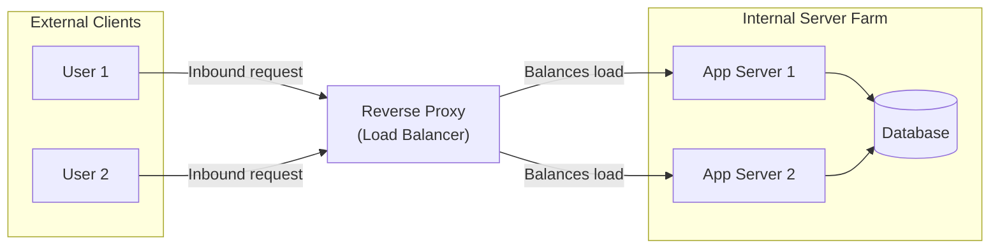

# Educational Tutorial: Introduction to Forward Proxies

Welcome to the Forward Proxy Lab. This tutorial is structured as an academic resource to teach students the core principles of proxy server architecture, transport protocols, and security enforcement.

---

## Lesson 1: What is a Forward Proxy?

A Forward Proxy is an intermediary server that acts on behalf of a group of clients (usually located within a private internal network) to facilitate and regulate their outbound requests to the external internet.

When an internal client requests a resource hosted on the public internet:
1. Instead of resolving the target domain and establishing a direct connection, the client is configured to send all outbound traffic directly to the Forward Proxy.
2. The proxy intercepts the request and evaluates it against set administrative policies (such as domain blocklists or rate limits).
3. If the request is compliant, the proxy establishes a connection to the external destination server, retrieves the resource, and returns it to the client.
4. The external server views the connection as originating from the proxy server's IP address, masking the internal client's identity.

---

## Lesson 2: Forward Proxy vs. Reverse Proxy

Understanding the distinction between forward and reverse proxies depends on identifying which side of the network connection (client or server) the proxy represents.

### 1. Forward Proxy (Client-Side Proxy)
A Forward Proxy represents the client. It intercepts outbound traffic from a private network to the public internet. The destination server remains unaware of the specific client's IP address.



### 2. Reverse Proxy (Server-Side Proxy)
A Reverse Proxy represents the server farm. It intercepts inbound traffic from the public internet to internal servers. External clients believe they are communicating directly with the primary server, but the Reverse Proxy intercepts requests to handle load balancing, SSL/TLS termination, or caching.



### Key Differences Comparison

| Architectural Dimension | Forward Proxy | Reverse Proxy |
| :--- | :--- | :--- |
| **Primary Beneficiary** | Clients (protects/controls internal network users) | Servers (protects/accelerates back-end infrastructure) |
| **Configuration** | Explicitly configured on client browser or system | Transparent to client (client accesses public DNS) |
| **Visibility** | Hides client IP from external servers | Hides server IPs from external clients |
| **Common Uses** | Access control, content filtering, employee audit logs | Load balancing, SSL termination, DDoS protection, Web Application Firewalls (WAF) |

---

## Lesson 3: Transport Protocol Mechanics (GET vs. CONNECT)

Forward proxies handle standard HTTP (unencrypted) and HTTPS (encrypted) traffic differently.

### 1. HTTP Forwarding (GET/POST Proxying)
For unencrypted HTTP requests, the proxy can inspect and modify request headers and payloads.
- The client establishes a TCP connection to the proxy port (e.g., 8888).
- The client formats the HTTP request using the absolute URL of the target resource:
  ```http
  GET http://example.com/index.html HTTP/1.1
  Host: example.com
  User-Agent: Client/1.0
  ```
- The proxy parses the absolute URL, verifies that `example.com` is permitted, establishes a separate connection to the host, retrieves the content, and passes the HTTP response headers and body back to the client.

### 2. HTTPS Forwarding (CONNECT Tunneling)
For encrypted HTTPS traffic, the proxy cannot decrypt the transmission without dedicated SSL-inspection certificates. Instead, it acts as a blind TCP tunnel using the HTTP CONNECT method.
- The client initiates connection by sending a plain-text CONNECT header to the proxy:
  ```http
  CONNECT example.com:443 HTTP/1.1
  Host: example.com:443
  ```
- The proxy reads the target host (`example.com`) to evaluate the blocklist.
- If allowed, the proxy establishes a raw TCP socket connection to `example.com` on port 443.
- The proxy returns a confirmation to the client:
  ```http
  HTTP/1.1 200 Connection Established
  ```
- From this point, the proxy operates as a bi-directional pipe, routing raw TCP bytes back and forth. The TLS handshake and subsequent payload encryption take place directly between the client and target server, keeping the data confidential from the proxy.

---

## Lesson 4: Student Hands-on Lab Demonstrations

Use command-line utilities to inspect proxy operations. Open a terminal and run the following exercises against the proxy running on `localhost:8888`.

### Exercise 1: Standard HTTP Proxying
Run the following command to request a resource through the proxy using verbose output:
```bash
curl.exe -v -x http://localhost:8888 http://httpbin.org/ip
```
Observe the request line sent by curl to the proxy:
`GET http://httpbin.org/ip HTTP/1.1`
The proxy processes this, queries `httpbin.org`, and returns the JSON payload.

### Exercise 2: HTTPS CONNECT Tunneling
Run the following command to observe the tunnel initialization:
```bash
curl.exe -v -x http://localhost:8888 https://httpbin.org/user-agent
```
Observe the response in the terminal logs:
```http
> CONNECT httpbin.org:443 HTTP/1.1
> Host: httpbin.org:443
< HTTP/1.1 200 Connection Established
```
Once established, notice that the TLS handshake begins directly inside the tunnel.

### Exercise 3: Access Control Blocklist
Configure a block rule for a domain, then verify that the proxy terminates blocked requests.
1. Add `restrictedsite.com` to the blocklist in the Admin Console.
2. Send an HTTP request:
   ```bash
   curl.exe -i -x http://localhost:8888 http://restrictedsite.com
   ```
   *Expected Output:*
   ```http
   HTTP/1.1 403 Forbidden
   Content-Type: text/plain

   Access to restrictedsite.com is blocked by proxy policy.
   ```
3. Send an HTTPS request to the blocked domain:
   ```bash
   curl.exe -i -x http://localhost:8888 https://restrictedsite.com
   ```
   *Expected Output:*
   ```http
   curl: (56) CONNECT tunnel failed, response 403
   HTTP/1.1 403 Forbidden
   Connection: close
   ```

---

## Lesson 5: Student Review Questions & Challenges

### Review Questions
1. Why does a client send a full URL (e.g. `http://example.com/page.html`) instead of just a path (e.g. `/page.html`) when communicating with a forward proxy?
2. Explain why a forward proxy server cannot inspect the contents of request payloads sent over an HTTPS CONNECT tunnel.
3. If an organization wants to prevent users from visiting social media sites but allow accessing educational resources, which proxy architecture (Forward or Reverse) should be deployed?

### Troubleshooting Lab Challenge
If a student adds `example.com` to the blocklist but finds they can still access `subdomain.example.com`, inspect the matching logic in the proxy code.
- Hint: Look at `hostname.includes(rule.domain)` in `backend/index.js`. Explain how domain wildcards and exact subdomain matching should be structured to prevent bypasses.
